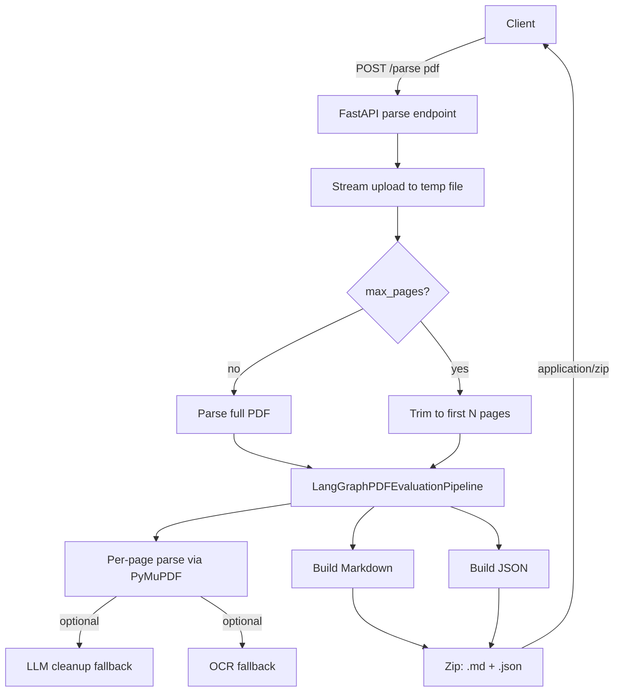

# Parsing Evaluator (PDF -> Markdown + JSON)

Turn a PDF into two outputs:

- A single Markdown file where each PDF page becomes its own section (easy to read, diff, and review)
- A JSON file with the same per-page text plus structured fields (metadata, links, issues, and metrics) for programmatic use

This repo includes:

- A parsing pipeline built on PyMuPDF that extracts text page-by-page, with optional LLM cleanup and OCR fallbacks when text extraction is poor.
- A FastAPI service that exposes that pipeline as a single file-upload endpoint, returning a zip containing the Markdown + JSON outputs.

## Why this Parsing Evaluator is important

If you’re building anything on top of PDFs (search, compliance, knowledge bases, chatbots), parsing quality is the foundation. A “slightly messy” extraction is not slightly messy downstream — it becomes:

- broken chunking (headings/sections get merged or split incorrectly)
- missing or duplicated sentences (bad retrieval + confusing answers)
- lost links/structure (harder to cite sources and trace evidence)
- noisy tokens (higher cost, lower relevance)

This project gives you a repeatable way to **parse PDFs** *and* **measure how good the parsing is**, so improvements are data-driven instead of guesswork.

## How this helps in a RAG system

In a typical RAG pipeline, parsing sits right before chunking + embeddings. Better parsing improves almost every step:

- **Cleaner chunks → better embeddings → better retrieval.**
- **Stable per-page output** makes it easier to debug “why did the model answer this?” and to keep citations accurate.
- **Structured JSON outputs** (links, issues, quality signals) can be used to route documents:
  - retry with OCR if extraction looks weak
  - apply LLM cleanup only when needed (cost control)
  - skip or flag pages with low confidence

In short: good RAG starts with good text, and good text starts with good parsing.

## Quickstart

```bash
. .venv/bin/activate
uv sync
uvicorn src.api.main:app --reload --port 8000
```

Health check:

```bash
curl -sS http://127.0.0.1:8000/health
```

## API

### `POST /parse`

Upload a PDF and receive a zip containing:

- `<pdf_name>.md`: Markdown with one section per page
- `<pdf_name>.json`: JSON with `parsed_pages` and `metrics`

Multipart fields:

- `pdf` (file, required): the PDF to parse

Query parameters:

- `llm_cleanup_enabled` (bool, default `false`): enable Ollama/Groq cleanup fallback
- `ocr_enabled` (bool, default `false`): enable OCR fallback (requires OCR deps)
- `max_workers` (int, default `4`): page parsing concurrency
- `max_pages` (int, optional): only parse the first N pages (recommended for very large PDFs)

Example:

```bash
curl -sS -X POST "http://127.0.0.1:8000/parse?max_workers=4" \
  -F "pdf=@pdfs/FAR_06.pdf" \
  -o FAR_06.zip
```

Inspect:

```bash
unzip -l FAR_06.zip
```

Large PDFs (first 10 pages only):

```bash
curl -sS -X POST "http://127.0.0.1:8000/parse?max_pages=10&max_workers=4" \
  -F "pdf=@pdfs/EM%20385-1-1_15%20March%202024.pdf" \
  -o EM_385_first_10.zip
```

### `GET /health`

Returns:

```json
{"status":"ok"}
```

## Pipeline (CLI)

The pipeline can also be run directly (writes results to `parsed_output/`, `ground_truth/`, and `evaluation/` by default):

```bash
. .venv/bin/activate
python pdf_paring.py pdfs/FAR_06.pdf
```

Notes:

- The CLI can generate ground-truth pages (via Ollama/Groq) and compute metrics.
- The API endpoint disables ground-truth generation by default and returns only parsing outputs.

## Output Format

### Markdown (`<name>.md`)

- Title header: `# <pdf_name>`
- One section per page: `## Page N`
- Source and quality stats per page
- Extracted text (plus a “Links” section when present)

### JSON (`<name>.json`)

Contains:

- `pdf_name`
- `parsed_pages`: list of `{page, text, source, quality, links, issues}`
- `metrics`: evaluation structure (when ground-truth is present, otherwise it will contain a “No ground truth...” issue)

## LLM / OCR Options

By default, the API runs with `llm_cleanup_enabled=false` and `ocr_enabled=false`.

LLM cleanup / ground-truth:

- Groq (hosted, optional): uses `GROQ_API_KEY`, `GROQ_GT_MODEL`, `GROQ_BASE_URL`
- Ollama (local fallback): uses `OLLAMA_HOST`, `OLLAMA_GT_MODEL`, `OLLAMA_TIMEOUT_SECONDS`

OCR fallback requires additional system/python dependencies (not installed by default in this repo). If you enable `ocr_enabled=true` without OCR deps present, the pipeline will record an issue and continue.

## Evaluation metrics (what we measure)

When ground-truth is available (CLI mode), the evaluator compares parsed text vs ground-truth page-by-page and reports:

- **WER (Word Error Rate)**: normalized word-level edit distance (lower is better)
- **CER (Character Error Rate)**: normalized character-level edit distance (lower is better)
- **Line precision / recall / F1**: exact-line matches after normalization (higher is better)
- **Token coverage**: unique word overlap vs ground-truth (higher is better)

The metrics JSON also includes totals like `char_edits`, `word_edits`, and counts used to compute the final scores.

## Models used in this project (and why the model matters)

This repo uses an LLM for two optional jobs:

1. **LLM cleanup**: fix obvious line-wrap / hyphenation artifacts without summarizing
2. **Ground-truth generation (CLI)**: generate “expected/clean” text for a small set of pages so we can score parsing quality

Current defaults in code:

- **Groq model (if configured)**: `llama-3.1-8b-instant` (env: `GROQ_GT_MODEL`)
- **Ollama local model (fallback)**: `qwen3.5` (env: `OLLAMA_GT_MODEL`)

Why the model matters: if the model *hallucinates*, *summarizes*, or “cleans too aggressively”, your evaluation becomes misleading. The best model for this task is the one that is **faithful** (doesn’t invent text), **consistent** (similar output across runs), and **strong at formatting/structure** (lists, headings, numbered clauses).

## Steps to integrate an Ollama local model

1. Install Ollama and start the server (default: `http://127.0.0.1:11434`).
2. Pull a model (example):

   ```bash
   ollama pull qwen3.5
   ```

3. Set environment variables (optional but recommended):

   ```bash
   export OLLAMA_HOST="http://127.0.0.1:11434"
   export OLLAMA_GT_MODEL="qwen3.5"
   export OLLAMA_TIMEOUT_SECONDS="600"
   ```

4. Enable it when running:
   - **API**: call `/parse` with `llm_cleanup_enabled=true`
   - **CLI**: run `python pdf_paring.py ...` (ground-truth + evaluation is enabled by default; see `GENERATE_GT_WITH_OLLAMA`, `ENABLE_LLM_CLEANUP`)

If `GROQ_API_KEY` is not set (or Groq errors), the pipeline automatically falls back to Ollama for cleanup and ground-truth generation.

Tip: Keep the model local for repeatable evaluation runs. You’ll get more consistent comparisons while you iterate on parsing logic.

## Mermaid (Flow)



## Repo Layout

- `src/api/main.py`: FastAPI app (`/health`, `/parse`)
- `pdf_parsing_pipeline.py`: pipeline implementation
- `pdf_paring.py`: CLI runner (batch)
- `pdfs/`: sample PDFs for local testing
- `api_outputs/`: optional local artifacts from calling the API (ignored by default)
